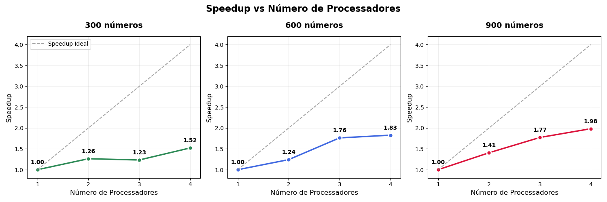

# Análise de Speedup em Execução Paralela - Insert Sort

Grupo: Fernanda Ferreira de Mello, Gaya Isabel Pizoli, Vitor Lamas Esposito

## Visão Geral

Este relatório contém a análise de desempenho de um algoritmo de Insert-Sort paralelo executado com diferentes números de processadores e tamanhos de problema.

## Objetivo

Analisar a eficiência da paralelização através de gráficos de speedup.

## Dados Experimentais

### Configurações Testadas
- **Tamanhos de problema**: 300, 600, 900 números
- **Processadores**: 1, 2, 3, 4 cores
- **Métrica**: Tempo de execução em segundos

### Tempos de Execução Coletados
| Números | 1 proc | 2 proc | 3 proc | 4 proc |
|---------|--------|--------|--------|--------|
| 300     | 0.003807s | 0.003014s | 0.003087s | 0.002501s |
| 600     | 0.015935s | 0.012831s | 0.009037s | 0.008715s |
| 900     | 0.035413s | 0.025181s | 0.019973s | 0.017854s |

## Resultados Principais

### Speedup Máximo por Caso
- **300 números**: 1.52x (4 processadores)
- **600 números**: 1.83x (4 processadores)  
- **900 números**: 1.98x (4 processadores)

### Eficiência de Paralelização
- **Melhor caso**: 50% de eficiência (900 números, 4 processadores)
- **Pior caso**: 38% de eficiência (300 números, 4 processadores)

## Principais Observações

1. **Escalabilidade positiva**: Problemas maiores apresentam melhor speedup
2. **Overhead significativo**: Nenhum caso alcançou speedup linear ideal
3. **Anomalia nos 300 números**: Degradação de desempenho com 3 processadores
4. **Tendência crescente**: Speedup melhora consistentemente com o tamanho do problema

## Características dos Gráficos

- **Linha sólida**: Speedup real obtido
- **Linha tracejada**: Speedup ideal (linear)
- **Anotações**: Valores exatos de speedup em cada ponto
- **Cores**: Verde (300), Azul (600), Vermelho (900)

## Especificação máquina

- **CPU**: 11th Gen Intel Core i7-11390H
- **GRAPHICS**: NVIDIA TU117M [GeForce MX450] | Intel TigerLake-LP GT2 [Iris Xe Graphics]
- **SSD**: 500 GB
- **MEM**: 16 GB 
- **Arquitetura**: x86_64
- **Modo(s) operacional da CPU**: 32-bit, 64-bit
- **Address sizes**: 39 bits physical, 48 bits virtual
- **Ordem dos bytes**: Little Endian
- **CPU(s)**: 8
- **Thread(s) per núcleo**: 2
- **Núcleo(s) por soquete**: 4
- **Soquete(s)**: 1
- **Step**: 2
- **CPU MHz máx**: 5000,0000
- **CPU MHz mín**: 400,0000

## Conclusões

O estudo demonstra que a eficácia da paralelização está diretamente relacionada ao tamanho do problema. Para problemas pequenos, o overhead pode superar os benefícios, enquanto problemas maiores apresentam melhor aproveitamento dos recursos paralelos.
