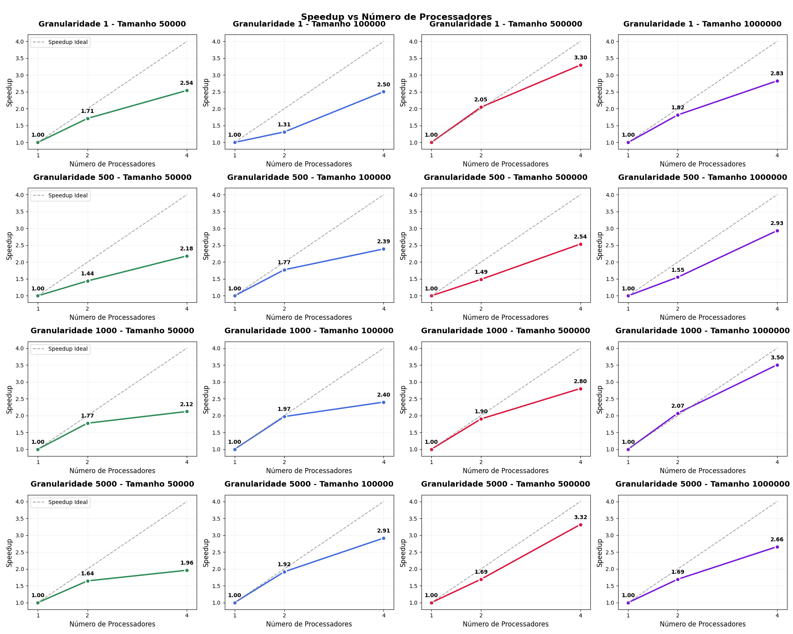

# Análise de Speedup em Execução Paralela - Merge Sort

Grupo: Fernanda Ferreira de Mello, Gaya Isabel Pizoli, Vitor Lamas Esposito

## Visão Geral

Este relatório contém a análise de desempenho de um algoritmo de Merge-Sort paralelo executado com diferentes números de processadores, tamanhos de problema, e divisões de granularidades mínimas diferentes.

## Objetivo

Analisar a eficiência da paralelização através de gráficos de speedup.

## Dados Experimentais

### Configurações Testadas
- **Tamanhos de problema**: 50000, 100000, 500000, 1000000 números
- **Processadores**: 1, 2, 4 cores
- **Métrica**: Tempo de execução em segundos

### Tempos de Execução Coletados

#### Execução do programa sequencial
| Tamanho | Tempo  |
|---------|--------|
| 50000     | 0.006930s |
| 100000    | 0.016867s |
| 500000    | 0.071829s |
| 1000000   | 0.140054s |

#### Granularidade mínima igual a 1
| Tamanho | 1 proc | 2 proc | 4 proc |
|---------|--------|--------|--------|
| 50000   | 0.116638s | 0.068143s | 0.045884s |
| 100000  | 0.215335s | 0.164258s | 0.085965s |
| 500000  | 1.239434s | 0.605324s | 0.376127s |
| 1000000 | 2.395317s | 1.319387s | 0.847059s |

#### Granularidade mínima igual a 500
| Tamanho | 1 proc | 2 proc | 4 proc |
|---------|--------|--------|--------|
| 50000   | 0.008533s | 0.005924s | 0.003907s |
| 100000  | 0.017033s | 0.009607s | 0.007124s |
| 500000  | 0.086655s | 0.058231s | 0.034174s |
| 1000000 | 0.195443s | 0.125859s | 0.066597s |

#### Granularidade mínima igual a 1000
| Tamanho | 1 proc | 2 proc | 4 proc |
|---------|--------|--------|--------|
| 50000   | 0.008000s | 0.004514s | 0.003774s |
| 100000  | 0.020448s | 0.010387s | 0.008529s |
| 500000  | 0.094249s | 0.049631s | 0.033649s |
| 1000000 | 0.190690s | 0.092126s | 0.054412s |

#### Granularidade mínima igual a 5000
| Tamanho | 1 proc | 2 proc | 4 proc |
|---------|--------|--------|--------|
| 50000   | 0.008762s | 0.005330s | 0.004470s |
| 100000  | 0.019760s | 0.010317s | 0.006780s |
| 500000  | 0.094068s | 0.055543s | 0.028345s |
| 1000000 | 0.181873s | 0.107390s | 0.068355s |

## Resultados Principais

### Características dos Gráficos

- **Linha sólida**: Speedup real obtido
- **Linha tracejada**: Speedup ideal (linear)
- **Anotações**: Valores exatos de speedup em cada ponto
- **Cores**: Verde (50000), Azul (100000), Vermelho (500000), Roxo (1000000)

### Speedup Máximo por Caso

#### Granularidade mínima igual a 1
- **50000 números**: 2.54x (4 processadores)
- **100000 números**: 2.50x (4 processadores)  
- **500000 números**: 3.30x (4 processadores)
- **1000000 números**: 2.83x (4 processadores)

#### Granularidade mínima igual a 500
- **50000 números**: 2.18x (4 processadores)
- **100000 números**: 2.39x (4 processadores)  
- **500000 números**: 2.54x (4 processadores)
- **1000000 números**: 2.93x (4 processadores)

#### Granularidade mínima igual a 1000
- **50000 números**: 2.12x (4 processadores)
- **100000 números**: 2.40x (4 processadores)  
- **500000 números**: 2.80x (4 processadores)
- **1000000 números**: 3.50x (4 processadores)

#### Granularidade mínima igual a 5000
- **50000 números**: 1.96x (4 processadores)
- **100000 números**: 2.91x (4 processadores)  
- **500000 números**: 3.32x (4 processadores)
- **1000000 números**: 2.66x (4 processadores)

### Eficiência de Paralelização
É possível concluir que em alguns casos a paralelização do algoritmo foi bem eficiente, chegando próxima a aceleração máxima do programa paralelo. Um dos principais casos onde se percebeu este compotamento foi durante o teste com granularidade 1000, tamanho 1000000 e 2 processadores.

## Principais Observações

1. **Escalabilidade positiva**: Problemas de tamanhos maiores apresentam melhor speedup
2. **Overhead significativo**: Nenhum caso alcançou speedup linear ideal
4. **Tendência crescente**: Speedup melhora consistentemente com o tamanho do problema, ainda que a dimensão desta melhora varie dependendo dos parâmetros

## Especificação máquina

- **CPU**: 8th Gen Intel Core i7-8665U
- **GRAPHICS**: Intel UHD Graphics 620 (128 MB)
- **SSD**: 477 GB
- **MEM**: 32 GB 
- **Arquitetura**: x86_64
- **Modo(s) operacional da CPU**: 64-bit
- **Ordem dos bytes**: Little Endian
- **Número de núcleos de CPU**: 4
- **Thread(s) por núcleo**: 2
- **Frequência máxima do processador (GHz)**: 4.80 GHz
- **Frequência base do processador (GHz)**: 1.90 GHz

## Conclusões

Ao analisar estes resultados, concluiu-se que a escolha dos parâmetros de granularidade e tamanho do problema, especialmente o tamanho, tem uma grande influência no ganho de desempenho que se obtém ao paralelizar a solução do Merge Sort. Assim como foi identificado durante os testes da solução do algoritmo Insert Sort, entende-se que para problemas pequenos, o overhead pode superar os benefícios, enquanto problemas maiores podem se beneficiar mais da paralelização da solução.