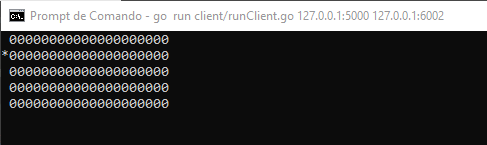
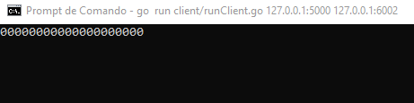
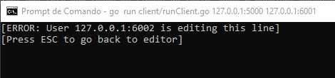
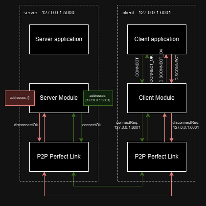
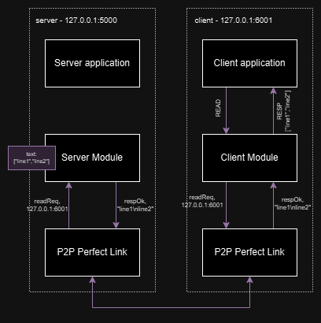
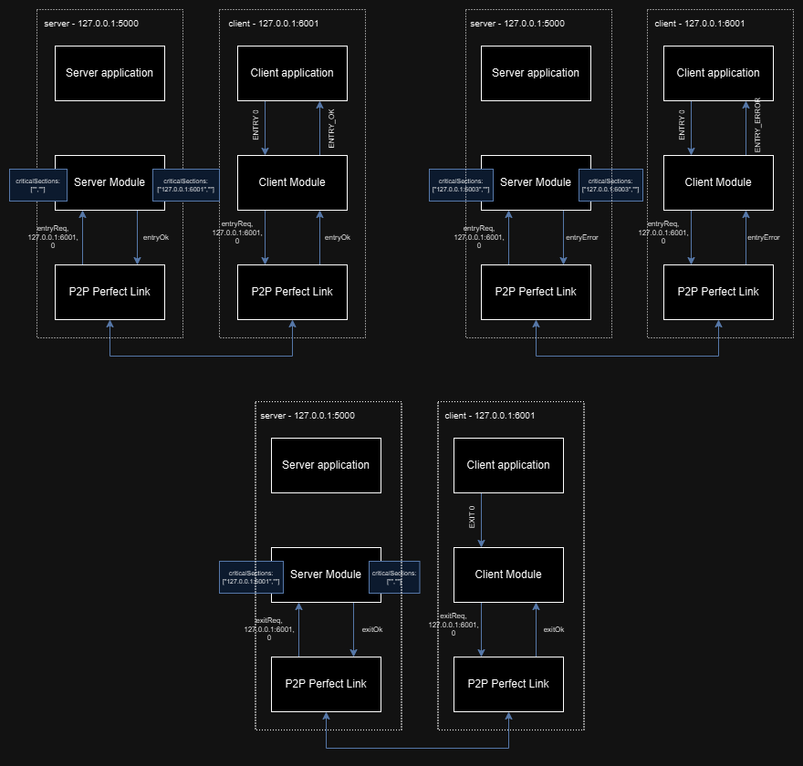
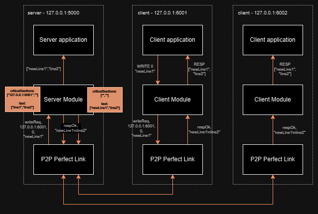

# Sistema distribuído de editor de texto
### Grupo: Fernanda Ferreira de Mello, Gaya Isabel Pizoli, Vitor Lamas Esposito

Esta é uma implementação de um sistema distribuído de editor de texto, onde processos cliente podem se conectar e desconectar dinamicamente a um servidor central, responsável por manter o estado do texto editado por múltiplos clientes. Nesta solução, ao inicializar o servidor central cria-se um texto com um número fixo de linhas, e os processos cliente não podem editar uma mesma linha simultaneamente - cada um deve acessar e editar cada linha de forma exclusiva.

Este sistema não trata a possibilidade de que ocorram falhas na transmissão de mensagens na rede e assume que todos os processos são corretos.

## Como executar o sistema?

Para execução do servidor central, é preciso executar disparar a execução da [aplicação do servidor](./server/runServer.go) informando 4 argumentos: a quantidade de linhas do texto, a quantidade de colunas iniciais do texto (caracteres por linha), o nome do arquivo para o qual serão persistidas as linhas do texto, e o endereço do servidor.

```shell
go run server/runServer.go 5 20 20250628-texto.txt 127.0.0.1:5000
```

Já para execução de um ou mais processos cliente,  é preciso executar disparar a execução da [aplicação do cliente](./client/runClient.go) informando 2 argumentos: o endereço do servidor e o endereço do cliente.

```shell
go run client/runClient.go 127.0.0.1:5000 127.0.0.1:6001
```

## Como editar o texto via terminal?

Ao disparar a execução do cliente, será possível visualizar via terminal uma tela com todas as linhas do texto, onde é possível navegar para cima e para baixo sobre as linhas do texto (o caracter * antes de uma linha representa o cursor da tela) conforme imagem abaixo:



Caso se queira sair do editor de texto, basta clicar na tecla Esc.
Caso se queira editar a linha selecionada pelo cursor, basta clicar na tecla Enter.

Ao selecionar a edição de uma linha, podem ocorrer dois cenários:
1. Nenhum outro usuário está editando esta linha. Neste caso, será exibida a tela abaixo, onde é possível mover o cursor para direita ou esquerda, deletar caracteres com a tecla de Backspace, e escrever novos caracteres na linha.
    - Caso se queira cancelar a edição da linha, basta clicar na tecla Esc.
    - Caso se queira salvar as alterações feitas na linha, basta clicar na tecla Enter.

    

2. Já existe algum usuário editando esta linha. Neste caso, será exibida a tela de erro abaixo e se deve clicar Esc e aguardar que o outro usuário libere a linha.

    


## Como é feita a comunicação entre os processos?

### Processo cliente conectar e desconectar do servidor central



### Processo cliente lê texto mantido pelo servidor central



### Processo cliente solicita acesso ou libera acesso a linha do texto para edição



### Processo cliente escreve linha no texto

